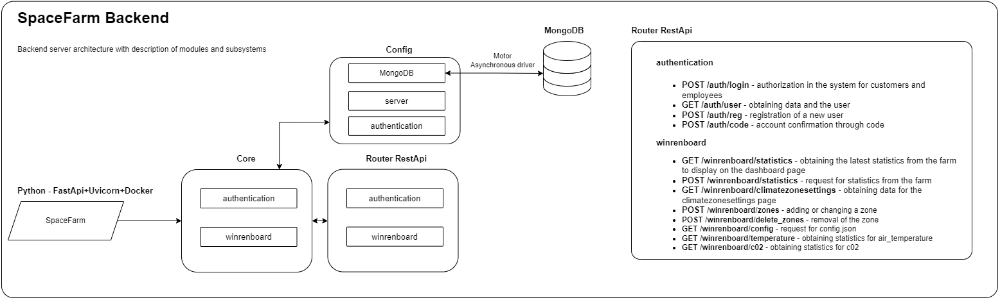

# SpaceFarm.back
>Live demo: https://spacefarm.ai

# Build Setup
```bash
# install docker
# install docker-compose
# collecting containers
sudo docker-compose -f docker-compose.yml build
# container launch
sudo docker-compose -f docker-compose.yml up
```

# Directories

App is a backend part of the Spacefarm project written in Python + FastApi.
Database - MongoDB
Message broker - RabbitMQ

### `app.router`

Includes logically separated files with RestAPI requests

### `app.core`

It is the core of the system based on the division into the main classes of the system

### `app.models`

Includes a description of models for various queries and classes

### `app.config`

Turns on files with system configurations

# Docker
### `docker-compose`
Yml file with description of the services used

- spacefarm

Configuring the backend container. The list of actions for the container is in `Dockerfile-SpaceFarm`

- mongo

Сonfiguration of the database launch container

- nuxtjs

Container configuration for starting frontend parts. The list of actions for the container is in `Dockerfile-nuxt`

- rabbitmq

Сontainer configuration for launching a message broker

# The architecture of backend


